I study computer science at Oakland University and spend most of my time shipping things: an agent that runs my Mac from a text message, a job tracker that nudges you to follow up, a finance dashboard for my household, and an iOS app I co-founded that reached 150+ users. Right now I'm building **Portlkit**, client portals that help freelancers get paid.

 

<picture>
  <source media="(prefers-color-scheme: dark)" srcset="./assets/sections/work-dark.svg" />
  
</picture>

 

<a href="https://github.com/Jasmanss/Imperium">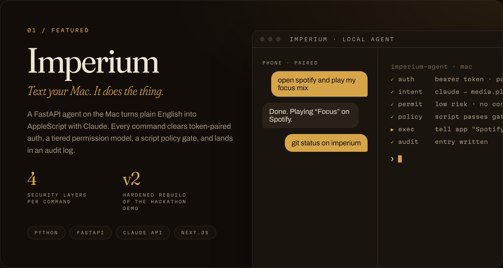</a>

<a href="https://github.com/Jasmanss/Imperium">CODE</a> &nbsp;·&nbsp; <a href="https://youtu.be/jEpbP-iGQTk">DEMO VIDEO</a>

<a href="https://jasmanss.github.io/callback/">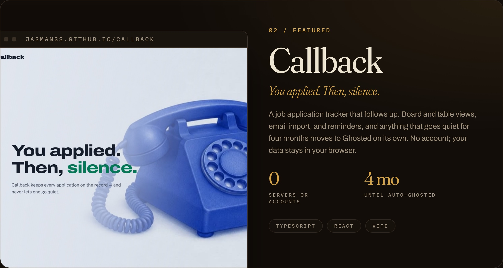</a>

<a href="https://jasmanss.github.io/callback/">LIVE</a> &nbsp;·&nbsp; <a href="https://github.com/Jasmanss/callback">CODE</a>

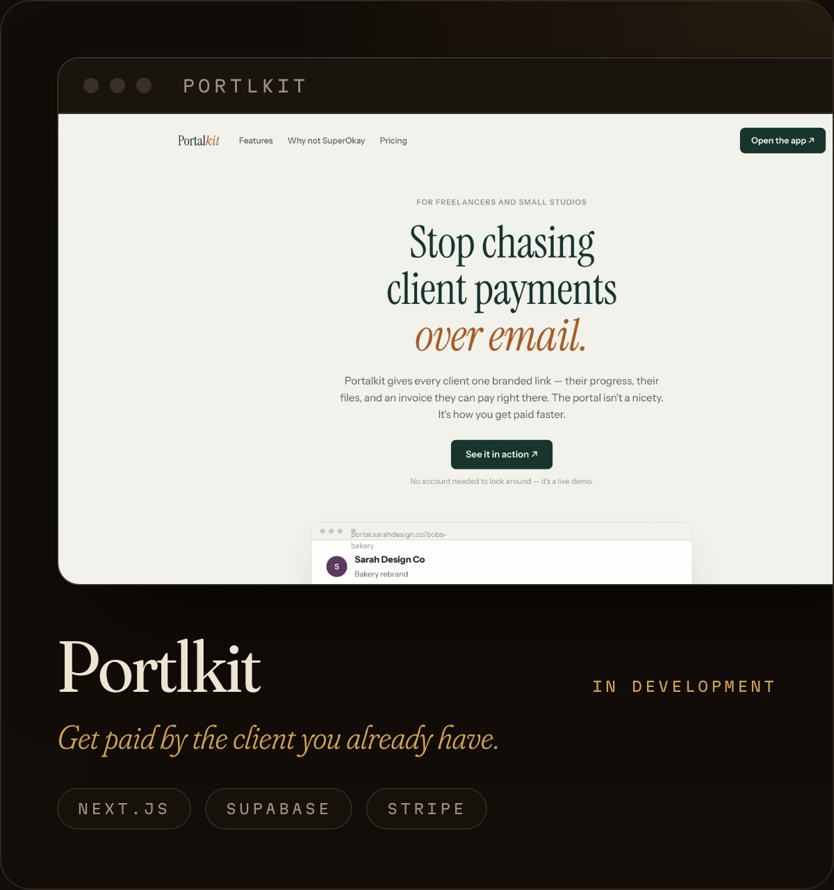&nbsp;<a href="https://haven-money.vercel.app">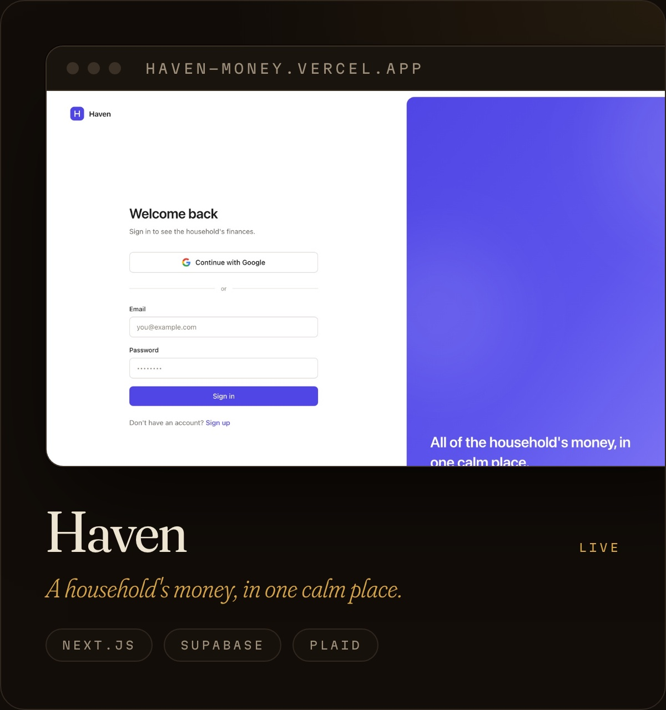</a>
<a href="https://github.com/Jasmanss/HairStyl">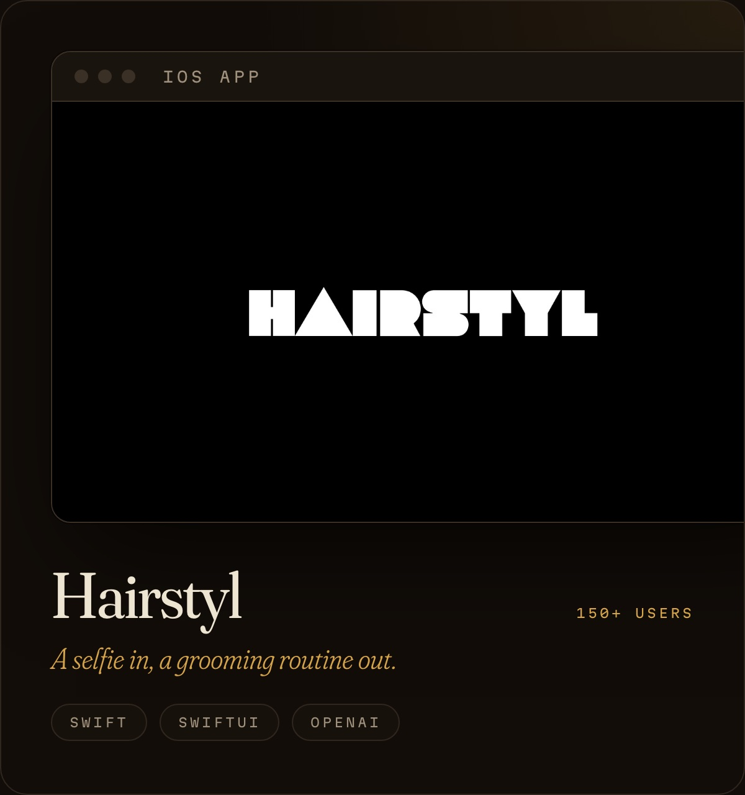</a>&nbsp;<a href="https://jasmanss.github.io/AromaAI/">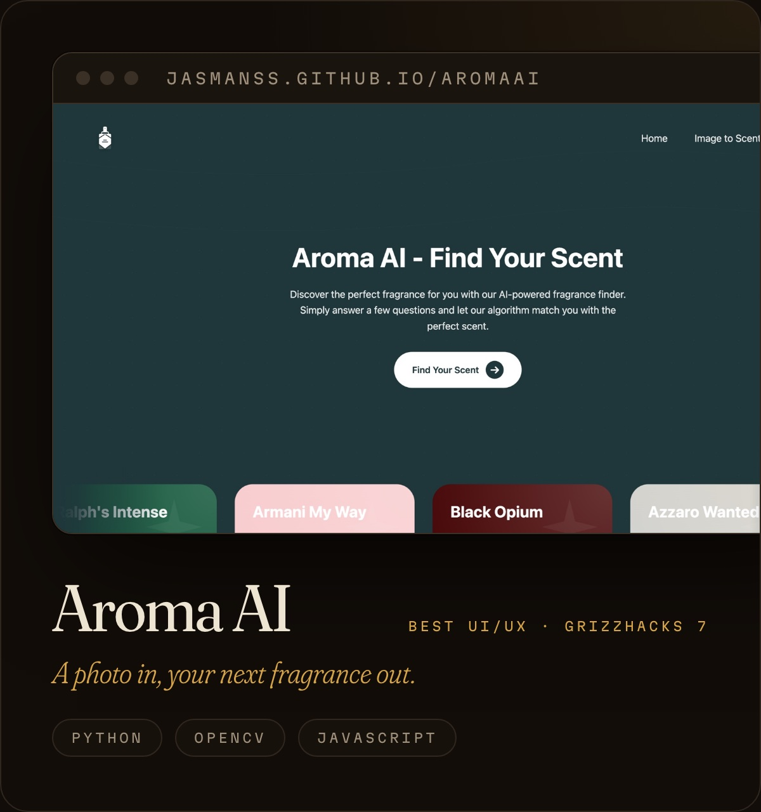</a>

  

<picture>
  <source media="(prefers-color-scheme: dark)" srcset="./assets/sections/experience-dark.svg" />
  
</picture>

 

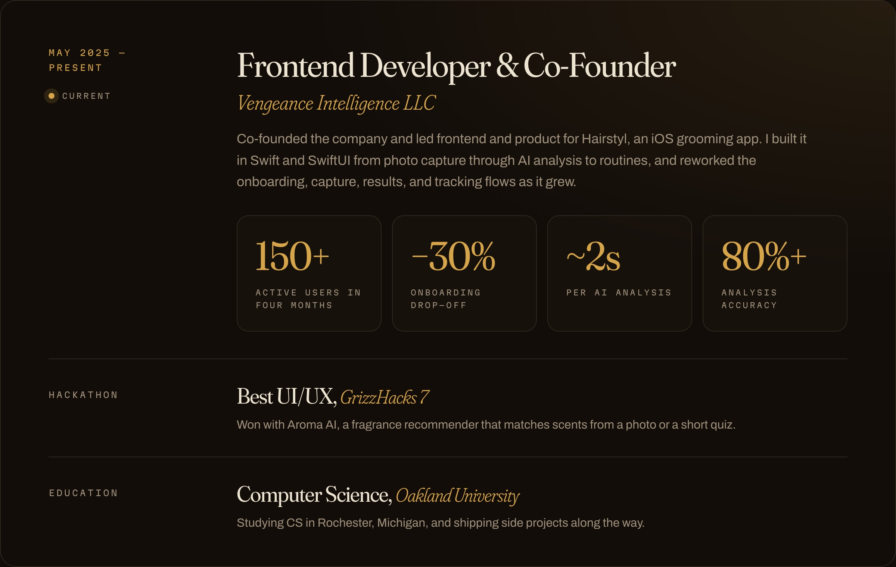

  

<picture>
  <source media="(prefers-color-scheme: dark)" srcset="./assets/sections/stack-dark.svg" />
  
</picture>

 


  

<picture>
  <source media="(prefers-color-scheme: dark)" srcset="./assets/sections/activity-dark.svg" />
  
</picture>

 


<picture>
  <source media="(prefers-color-scheme: dark)" srcset="https://raw.githubusercontent.com/Jasmanss/Jasmanss/output/snake-dark.svg" />
  <source media="(prefers-color-scheme: light)" srcset="https://raw.githubusercontent.com/Jasmanss/Jasmanss/output/snake.svg" />
  
</picture>
