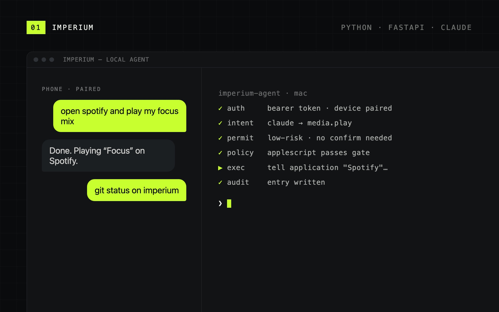
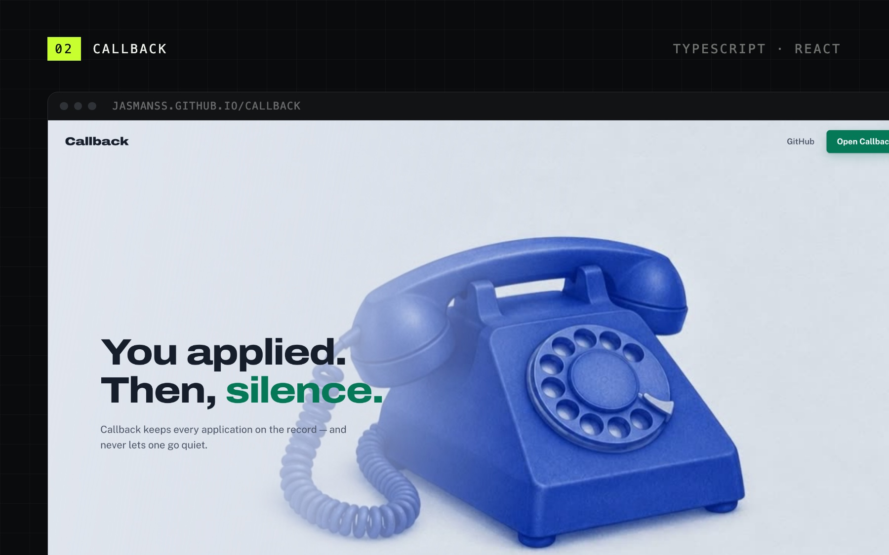
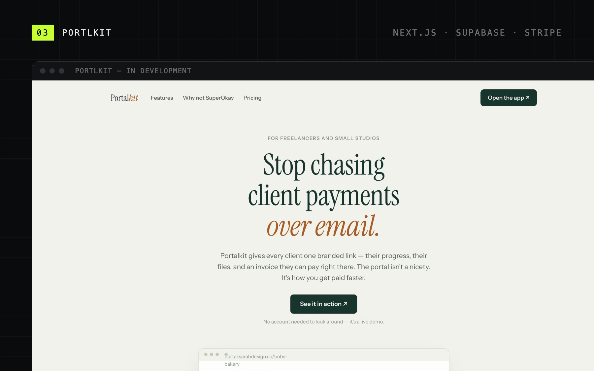
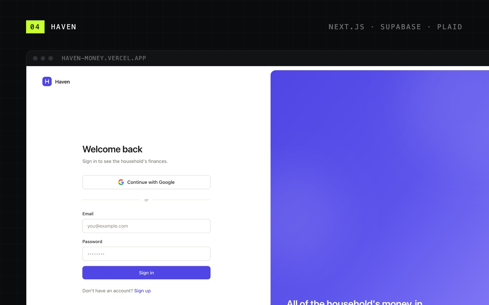
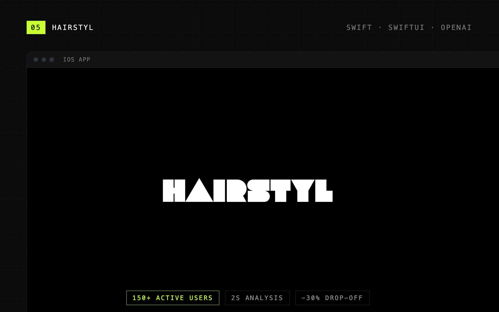
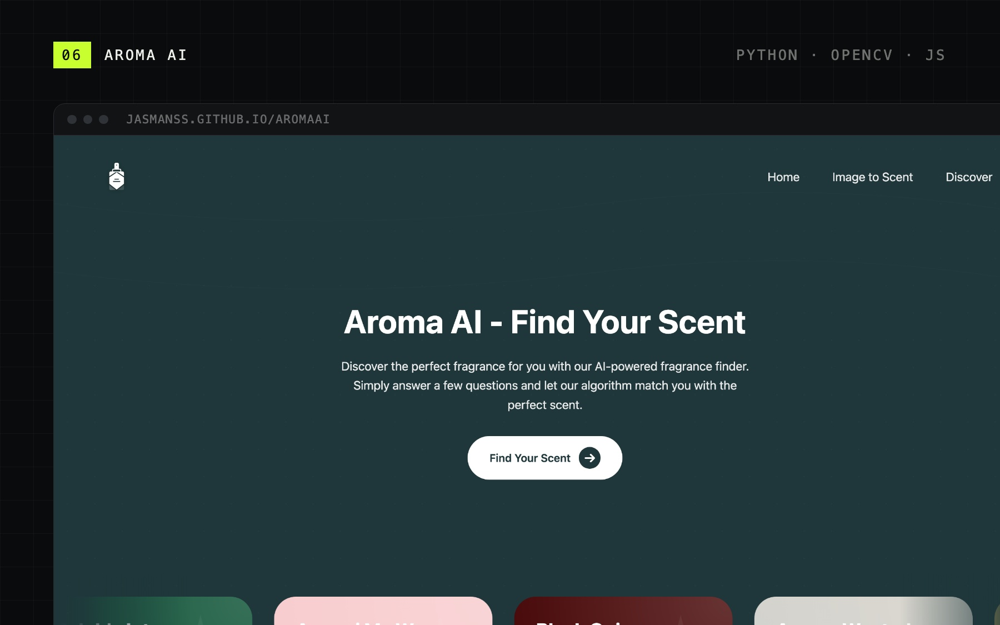

I'm a computer science student at Oakland University who builds software people can actually use: AI agents that take real actions, full-stack web apps, and iOS. Most of my projects start the same way: messy human input goes in, and something structured and useful comes out.

Currently building **Portlkit**, client portals that help freelancers get paid.

  
  
  

 

<picture>
  <source media="(prefers-color-scheme: dark)" srcset="./assets/sections/work-dark.svg" />
  
</picture>

<table>
  <tr>
    <td width="50%" valign="top">
      
      <h3>Imperium</h3>
      
Text your Mac from your phone and it does the task. A FastAPI agent turns plain English into AppleScript with Claude. Every command passes through token-paired auth, a tiered permission model, a script policy gate, and an audit log.

      
<a href="https://github.com/Jasmanss/Imperium">Code</a> &nbsp;·&nbsp; <a href="https://youtu.be/jEpbP-iGQTk">Demo video</a>

    </td>
    <td width="50%" valign="top">
      
      <h3>Callback</h3>
      
A job application tracker that follows up. Board and table views, email import, and follow-up reminders. Applications that go silent for four months move to Ghosted on their own. No account needed; data stays in the browser.

      
<a href="https://jasmanss.github.io/callback/">Live</a> &nbsp;·&nbsp; <a href="https://github.com/Jasmanss/callback">Code</a>

    </td>
  </tr>
  <tr>
    <td width="50%" valign="top">
      
      <h3>Portlkit</h3>
      
White-label client portals for freelancers and small studios, built around getting paid. Each client gets one branded link with their progress, files, and an invoice they can pay on the spot.

      
IN DEVELOPMENT

    </td>
    <td width="50%" valign="top">
      
      <h3>Haven</h3>
      
A private finance tracker for a household. Plaid connects bank, card, and brokerage accounts; Supabase stores it; one dashboard shows net worth, spending, transactions, and holdings. Signups are locked to household members at the database level.

      
<a href="https://haven-money.vercel.app">Live</a> &nbsp;·&nbsp; PRIVATE REPO

    </td>
  </tr>
  <tr>
    <td width="50%" valign="top">
      
      <h3>Hairstyl</h3>
      
An iOS grooming app that analyzes hair, beard, and eyebrows from a photo and builds a personal routine. I co-founded the company behind it and led the frontend. It reached 150+ active users in four months.

      
<a href="https://github.com/Jasmanss/HairStyl">Code</a>

    </td>
    <td width="50%" valign="top">
      
      <h3>Aroma AI</h3>
      
A fragrance recommender that matches a scent from a photo or a short quiz, using Python and OpenCV. Won <b>Best UI/UX at GrizzHacks 7</b>.

      
<a href="https://jasmanss.github.io/AromaAI/">Live</a> &nbsp;·&nbsp; <a href="https://github.com/Jasmanss/AromaAI">Code</a>

    </td>
  </tr>
</table>

 

<picture>
  <source media="(prefers-color-scheme: dark)" srcset="./assets/sections/experience-dark.svg" />
  
</picture>

**Frontend Developer & Co-Founder** · Vengeance Intelligence LLC &nbsp;MAY 2025 – PRESENT

- Built the Hairstyl iOS app in Swift and SwiftUI, from photo capture through AI analysis to personalized routines.
- Redesigned onboarding, capture, results, and tracking flows, cutting drop-off by 30%.
- Grew to 150+ active users in four months through steady UI improvements and releases.
- Worked with the backend developer on the AI pipeline to keep analysis around 2 seconds at 80%+ accuracy.

 

<picture>
  <source media="(prefers-color-scheme: dark)" srcset="./assets/sections/stack-dark.svg" />
  
</picture>

  

<picture>
  <source media="(prefers-color-scheme: dark)" srcset="./assets/sections/activity-dark.svg" />
  
</picture>

<picture>
  <source media="(prefers-color-scheme: dark)" srcset="https://raw.githubusercontent.com/Jasmanss/Jasmanss/output/snake-dark.svg" />
  <source media="(prefers-color-scheme: light)" srcset="https://raw.githubusercontent.com/Jasmanss/Jasmanss/output/snake.svg" />
  
</picture>
